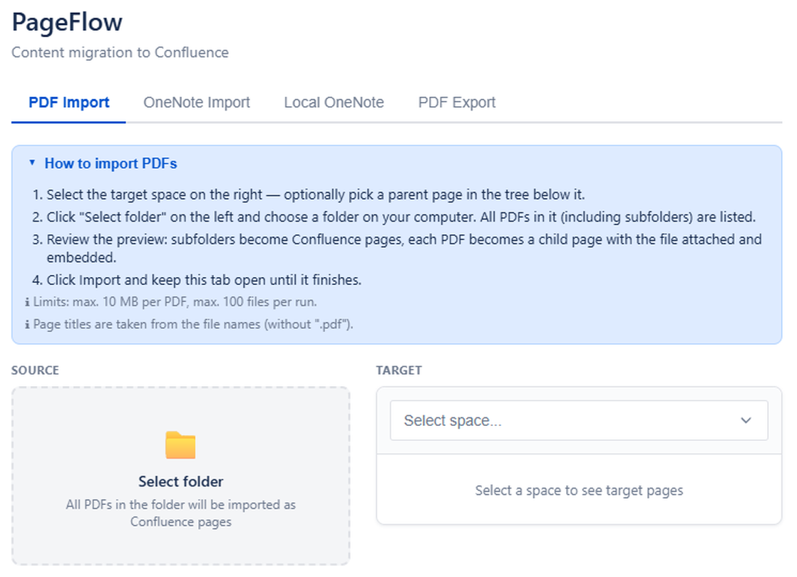
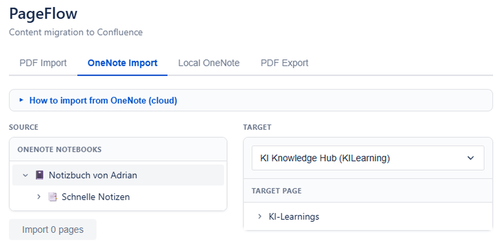
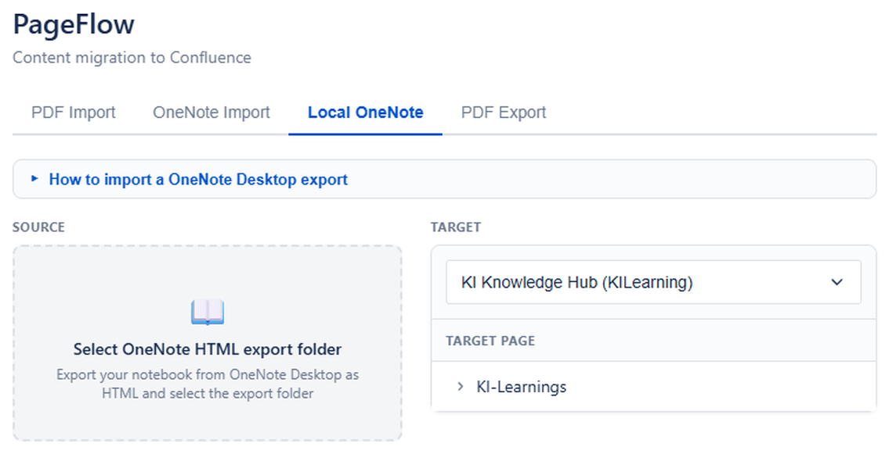
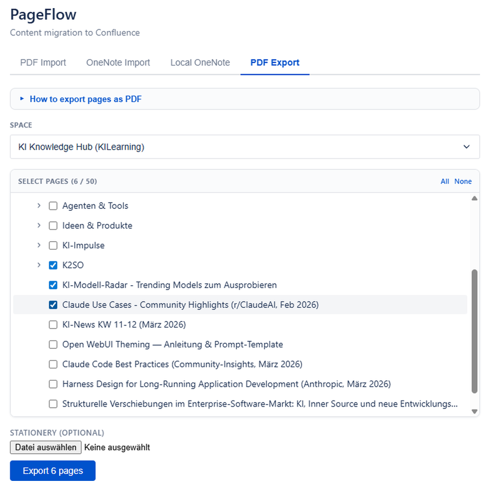

# Documentation — PageFlow

**Last updated:** June 13, 2026

PageFlow is a free Atlassian Forge app that migrates content into Confluence Cloud — from OneNote, PDF files, and local HTML exports.

## Getting Started

### Installation

1. Install PageFlow from the [Atlassian Marketplace](https://marketplace.atlassian.com/)
2. Open any Confluence space
3. Find **PageFlow** in the Apps menu (global page)

### First Import

1. Select a target **Space** from the dropdown
2. Choose a **parent page** for your imported content
3. Switch to the tab matching your source (PDF Import, OneNote, Local OneNote, PDF Export)
4. Follow the tab-specific instructions below

> **Tip:** Every tab has a collapsible **step-by-step help box** at the top that walks you through that tab's workflow, including limits and requirements.

## Features

### PDF Import

Import PDF files as Confluence pages with the original PDF attached.

- **Batch import**: Select a folder — every PDF in it (including subfolders) becomes a Confluence page with the file attached and embedded via the view-file macro
- Folder structure is mapped to a Confluence page hierarchy
- Per-file checkboxes let you pick which files to import
- Page titles are derived from the file names
- **Limit:** max. 10 MB per PDF, up to 100 files per run

### OneNote Import (Cloud)

Migrate OneNote notebooks from Microsoft 365 into Confluence.

1. Click **Connect Microsoft Account** to authorize via OAuth 2.0
2. Browse your Notebooks, Section Groups, and Sections
3. Select pages to import
4. Content is converted to Confluence format, and embedded images are downloaded from Microsoft Graph and uploaded as page attachments

**Image handling:** Up to 10 images per page are uploaded (max. 5 MB each). If an image cannot be fetched, the page is still imported and an info panel marks the missing image.

**Requirements:** Microsoft 365 account with OneNote access.

### Local OneNote Import

Import OneNote pages exported as HTML from the desktop application.

1. In OneNote Desktop: **File → Export → Page → HTML**
2. In PageFlow: Switch to **Local OneNote** tab
3. Select the exported `.htm` file(s) and associated `_files` folder
4. Pages are converted with embedded images uploaded as attachments

### PDF Export

Export Confluence pages into a single PDF document with optional custom stationery.

1. Switch to the **PDF Export** tab
2. Select pages from the checkbox tree — ticking a parent automatically selects all of its child pages
3. Optionally upload a stationery PDF (letterhead, watermark); its first page becomes the background of every exported page
4. Click **Export** — the PDF is generated client-side and downloaded as one combined file

The export renders headings, formatted text, lists, tables, code blocks, panels, and task lists. Each Confluence page starts on a new page with its title, and pages are numbered.

**Limit:** max. 50 pages per export. Split larger exports into multiple runs.

## Permissions

PageFlow requires the following Confluence permissions:

| Permission | Purpose |
|-----------|---------|
| Read spaces & pages | Browse and select import targets |
| Create pages | Create new pages during import |
| Upload attachments | Attach PDFs and images to pages |

For OneNote import, the App requests `Notes.Read` permission via Microsoft OAuth 2.0.

## Limits

- **Function timeout:** 25 seconds per operation (Atlassian Forge limit)
- **Memory:** 128 MB per function invocation
- **Batch import:** Up to 100 files per batch
- **Attachment size:** Subject to Confluence instance limits

## Troubleshooting

### OneNote connection fails

- Ensure you are using a Microsoft 365 account (personal or organizational)
- Try disconnecting and reconnecting your Microsoft account
- Check that your account has OneNote notebooks

### Import seems slow

- Large notebooks are imported page by page — this is expected
- Each page requires multiple API calls (content + images)
- Forge platform limits apply (25s per function call)

### PDF export shows "[Unsupported content]"

- Most content renders correctly: headings, text formatting, links, lists, tables, code blocks, panels, and task lists
- Macros that cannot be represented in a static PDF (e.g. Jira issue macros, dynamic content) appear as a small `[Unsupported content]` hint
- Images are referenced by file name; embedded image rendering in the PDF is limited

## Support

For questions or issues: [pageflow@adrianphilipp.de](mailto:pageflow@adrianphilipp.de)

## Related

- [Privacy Policy](index.md)
- [Terms of Service](terms.md)
- [Security Policy](security.md)
